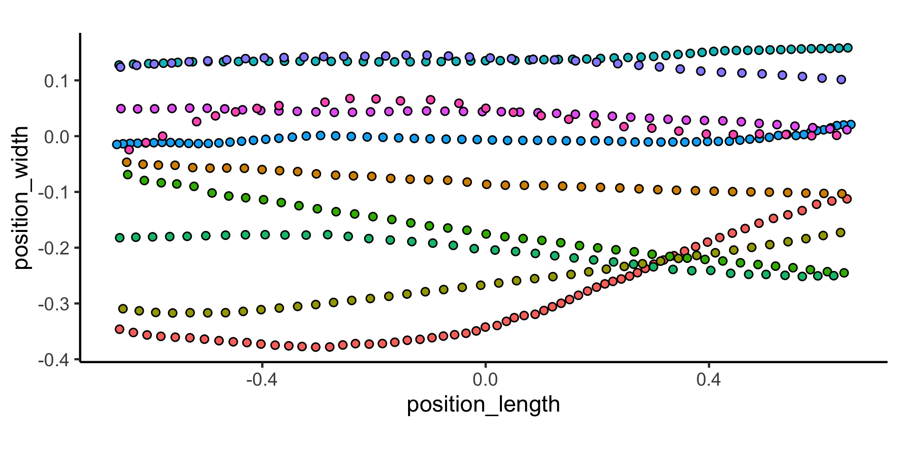
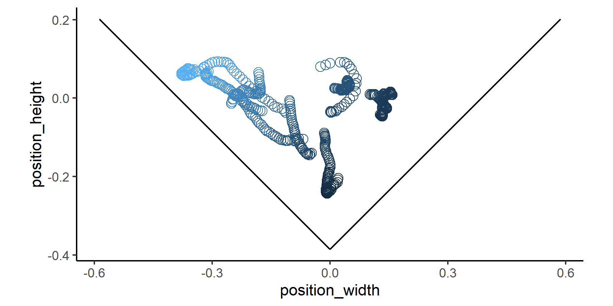

<!-- README.md is generated from README.Rmd. Please edit that file -->

# pathviewR <a href='https://vbaliga.github.io/pathviewR'></a>

<!-- badges: start -->

[](https://www.repostatus.org/#active)
[](https://github.com/vbaliga/pathviewR/actions)
[](https://travis-ci.org/vbaliga/pathviewR)
[](https://codecov.io/gh/vbaliga/pathviewR?branch=master)
[](https://github.com/ropensci/software-review/issues/409)
<!-- badges: end -->

`pathviewR` offers tools to import, clean, and visualize animal movement
data from motion capture systems such as [Optitrack’s
Motive](https://optitrack.com/software/motive/), the [Straw Lab’s
Flydra](https://github.com/strawlab/flydra), or other sources. We
provide functions to remove artifacts, standardize tunnel position and
tunnel axes, select a region of interest, isolate specific trajectories,
fill gaps in trajectory data, and calculate 3D and per-axis velocity.
For experiments of visual guidance, we also provide functions that use
animal position to estimate perception of visual stimuli.

## Installation

This package can be installed via:

``` r
#install.packages("devtools") # if devtools is not installed
devtools::install_github("vbaliga/pathviewR")
```

## Example

#### Data import and cleaning via `pathviewR`

We’ll also load two `tidyverse` packages for wrangling & plotting.

``` r
library(pathviewR)
library(ggplot2)
library(magrittr)
```

We will import and clean a sample data set from `.csv` files exported by
[Optitrack’s Motive](https://optitrack.com/software/motive/) software.
For examples of how to import and clean other types of data, [see the
data import and cleaning
vignette](https://vbaliga.github.io/pathviewR/articles/data-import-cleaning.html).

``` r
## Import the Motive example data included in 
## the package

motive_data <-
  read_motive_csv(
    system.file("extdata", "pathviewR_motive_example_data.csv",
                package = 'pathviewR')
  )
```

Several functions to clean and wrangle data are available, and we have a
suggested pipeline for how these steps should be handled. For this
example, we will use one of two “all-in-one” functions: `clean_viewr()`.
[See the Data Import and Cleaning
vignette](https://vbaliga.github.io/pathviewR/articles/data-import-cleaning.html)
for the full pipeline and the other “all-in-one” function.

``` r
motive_allinone <-
  motive_data %>%
  clean_viewr(
    relabel_viewr_axes = TRUE,
    gather_tunnel_data = TRUE,
    trim_tunnel_outliers = TRUE,
    standardization_option = "rotate_tunnel",
    select_x_percent = TRUE,
    desired_percent = 50,
    rename_viewr_characters = FALSE,
    separate_trajectories = TRUE,
    max_frame_gap = "autodetect",
    get_full_trajectories = TRUE,
    span = 0.95
  )
#> autodetect is an experimental feature -- please report issues.

## Quick plot
## Colors correspond to unique trajectories (file_sub_traj)
motive_allinone %>%
  ggplot(aes(x = position_length, y = position_width, 
             fill = file_sub_traj)) +
  geom_point(pch = 21) +
  coord_fixed() +
  theme_classic() +
  theme(
    legend.position = "none"
  )
```



To get a sense of what we’ve done, compare the data before and after it
has passed through the pipeline.

``` r
## Check out the data's structure before cleaning and wrangling:
str(motive_data)
#> tibble [934 × 26] (S3: tbl_df/tbl/data.frame)
#>  $ frame                     : int [1:934] 72210 72211 72212 72213 72214 72215 72216 72217 72218 72219 ...
#>  $ time_sec                  : num [1:934] 722 722 722 722 722 ...
#>  $ device02_rotation_x       : num [1:934] 0.1346 0.0819 0.2106 0.1961 0.1305 ...
#>  $ device02_rotation_y       : num [1:934] -0.977 -0.978 -0.973 -0.972 -0.975 ...
#>  $ device02_rotation_z       : num [1:934] -0.1117 -0.0991 -0.0939 -0.1275 -0.1213 ...
#>  $ device02_rotation_w       : num [1:934] 0.1215 0.1654 0.0311 0.0351 0.1315 ...
#>  $ device02_position_x       : num [1:934] 0.142 0.137 0.125 0.118 0.113 ...
#>  $ device02_position_y       : num [1:934] 0.16 0.164 0.166 0.168 0.173 ...
#>  $ device02_position_z       : num [1:934] 2 1.97 1.95 1.92 1.89 ...
#>  $ device02_mean_marker_error: num [1:934] 0.000113 0.000105 0.000115 0.000202 0.000106 0.000095 0.000114 0.000117 0.000121 0.000131 ...
#>  $ device03_rotation_x       : num [1:934] 0.107 0.111 0.109 0.109 0.108 ...
#>  $ device03_rotation_y       : num [1:934] -0.295 -0.295 -0.295 -0.295 -0.295 ...
#>  $ device03_rotation_z       : num [1:934] -0.088 -0.0866 -0.0853 -0.0853 -0.0879 ...
#>  $ device03_rotation_w       : num [1:934] 0.945 0.945 0.945 0.945 0.945 ...
#>  $ device03_position_x       : num [1:934] 0.222 0.222 0.222 0.222 0.222 ...
#>  $ device03_position_y       : num [1:934] 0.245 0.245 0.245 0.245 0.245 ...
#>  $ device03_position_z       : num [1:934] 0.0597 0.0597 0.0598 0.0598 0.0598 ...
#>  $ device03_mean_marker_error: num [1:934] 0.000166 0.000172 0.000164 0.000163 0.000162 0.000162 0.000169 0.00017 0.00017 0.000213 ...
#>  $ device05_rotation_x       : num [1:934] 0.00672 0.00714 0.00709 0.00742 0.00826 ...
#>  $ device05_rotation_y       : num [1:934] 0.944 0.944 0.944 0.944 0.944 ...
#>  $ device05_rotation_z       : num [1:934] -0.117 -0.116 -0.118 -0.118 -0.117 ...
#>  $ device05_rotation_w       : num [1:934] 0.308 0.308 0.309 0.31 0.308 ...
#>  $ device05_position_x       : num [1:934] 0.173 0.173 0.173 0.173 0.173 ...
#>  $ device05_position_y       : num [1:934] 0.243 0.243 0.243 0.243 0.243 ...
#>  $ device05_position_z       : num [1:934] 2.66 2.66 2.66 2.66 2.66 ...
#>  $ device05_mean_marker_error: num [1:934] 0.000241 0.000247 0.000255 0.000244 0.00023 0.000226 0.000231 0.000236 0.000242 0.000263 ...
#>  - attr(*, ".internal.selfref")=<externalptr> 
#>  - attr(*, "pathviewR_steps")= chr "viewr"
#>  - attr(*, "file_id")= chr "pathviewR_motive_example_data.csv"
#>  - attr(*, "file_mtime")= POSIXct[1:1], format: "2020-11-18 03:41:19"
#>  - attr(*, "frame_rate")= num 100
#>  - attr(*, "header")='data.frame':   11 obs. of  2 variables:
#>   ..$ metadata: chr [1:11] "Format Version" "Take Name" "Take Notes" "Capture Frame Rate" ...
#>   ..$ value   : chr [1:11] "1.23" "sept-18_mixed-group_16-30" "" "100.000000" ...
#>  - attr(*, "Motive_IDs")= chr [1:24] "\"9E207518D8A311E969D7AB6B1FACE49B\"" "\"9E207518D8A311E969D7AB6B1FACE49B\"" "\"9E207518D8A311E969D7AB6B1FACE49B\"" "\"9E207518D8A311E969D7AB6B1FACE49B\"" ...
#>  - attr(*, "subject_names_full")= chr [1:24] "device02" "device02" "device02" "device02" ...
#>  - attr(*, "subject_names_simple")= chr [1:3] "device02" "device03" "device05"
#>  - attr(*, "data_names")= chr [1:26] "frame" "time_sec" "device02_rotation_x" "device02_rotation_y" ...
#>  - attr(*, "data_types_full")= chr [1:24] "Rigid Body" "Rigid Body" "Rigid Body" "Rigid Body" ...
#>  - attr(*, "data_types_simple")= chr "Rigid Body"
#>  - attr(*, "d1")= chr [1:26] "" "" "Rotation" "Rotation" ...
#>  - attr(*, "d2")= chr [1:26] "Frame" "Time (Seconds)" "X" "Y" ...
#>  - attr(*, "import_method")= chr "motive"

## Check out the data's structure after cleaning and wrangling:
str(motive_allinone)
#> tibble [449 × 24] (S3: tbl_df/tbl/data.frame)
#>  $ frame            : int [1:449] 72213 72214 72215 72216 72217 72218 72219 72220 72221 72222 ...
#>  $ time_sec         : num [1:449] 722 722 722 722 722 ...
#>  $ subject          : chr [1:449] "device02" "device02" "device02" "device02" ...
#>  $ position_length  : num [1:449] 0.647 0.62 0.593 0.567 0.541 ...
#>  $ position_width   : num [1:449] -0.112 -0.116 -0.122 -0.134 -0.141 ...
#>  $ position_height  : num [1:449] -0.0371 -0.0324 -0.0273 -0.0235 -0.0209 ...
#>  $ rotation_length  : num [1:449] -0.128 -0.121 -0.105 -0.106 -0.149 ...
#>  $ rotation_width   : num [1:449] 0.1961 0.1305 0.0935 0.1798 0.164 ...
#>  $ rotation_height  : num [1:449] -0.972 -0.975 -0.975 -0.975 -0.972 ...
#>  $ rotation_real    : num [1:449] 0.0351 0.1315 0.1734 0.0807 0.0824 ...
#>  $ mean_marker_error: num [1:449] 0.000202 0.000106 0.000095 0.000114 0.000117 0.000121 0.000131 0.00014 0.000113 0.000114 ...
#>  $ velocity         : num [1:449] 2.73 2.78 2.84 2.85 2.68 ...
#>  $ length_inst_vel  : num [1:449] -2.65 -2.72 -2.74 -2.58 -2.56 ...
#>  $ width_inst_vel   : num [1:449] -0.642 -0.387 -0.58 -1.139 -0.75 ...
#>  $ height_inst_vel  : num [1:449] 0.184 0.475 0.508 0.379 0.258 ...
#>  $ traj_id          : int [1:449] 0 0 0 0 0 0 0 0 0 0 ...
#>  $ file_sub_traj    : chr [1:449] "pathviewR_motive_example_data.csv_device02_0" "pathviewR_motive_example_data.csv_device02_0" "pathviewR_motive_example_data.csv_device02_0" "pathviewR_motive_example_data.csv_device02_0" ...
#>  $ traj_length      : int [1:449] 63 63 63 63 63 63 63 63 63 63 ...
#>  $ start_length     : num [1:449] 0.647 0.647 0.647 0.647 0.647 ...
#>  $ end_length       : num [1:449] -0.656 -0.656 -0.656 -0.656 -0.656 ...
#>  $ length_diff      : num [1:449] 1.3 1.3 1.3 1.3 1.3 ...
#>  $ start_length_sign: num [1:449] 1 1 1 1 1 1 1 1 1 1 ...
#>  $ end_length_sign  : num [1:449] -1 -1 -1 -1 -1 -1 -1 -1 -1 -1 ...
#>  $ direction        : chr [1:449] "leftwards" "leftwards" "leftwards" "leftwards" ...
#>  - attr(*, "file_id")= chr "pathviewR_motive_example_data.csv"
#>  - attr(*, "file_mtime")= POSIXct[1:1], format: "2020-11-18 03:41:19"
#>  - attr(*, "frame_rate")= num 100
#>  - attr(*, "header")='data.frame':   11 obs. of  2 variables:
#>   ..$ metadata: chr [1:11] "Format Version" "Take Name" "Take Notes" "Capture Frame Rate" ...
#>   ..$ value   : chr [1:11] "1.23" "sept-18_mixed-group_16-30" "" "100.000000" ...
#>  - attr(*, "Motive_IDs")= chr [1:24] "\"9E207518D8A311E969D7AB6B1FACE49B\"" "\"9E207518D8A311E969D7AB6B1FACE49B\"" "\"9E207518D8A311E969D7AB6B1FACE49B\"" "\"9E207518D8A311E969D7AB6B1FACE49B\"" ...
#>  - attr(*, "subject_names_full")= chr [1:24] "device02" "device02" "device02" "device02" ...
#>  - attr(*, "subject_names_simple")= chr [1:3] "device02" "device03" "device05"
#>  - attr(*, "data_names")= chr [1:26] "frame" "time_sec" "device02_rotation_x" "device02_rotation_y" ...
#>  - attr(*, "data_types_full")= chr [1:24] "Rigid Body" "Rigid Body" "Rigid Body" "Rigid Body" ...
#>  - attr(*, "data_types_simple")= chr "Rigid Body"
#>  - attr(*, "d1")= chr [1:26] "" "" "Rotation" "Rotation" ...
#>  - attr(*, "d2")= chr [1:26] "Frame" "Time (Seconds)" "X" "Y" ...
#>  - attr(*, "import_method")= chr "motive"
#>  - attr(*, "pathviewR_steps")= chr [1:10] "viewr" "renamed_tunnel" "gathered_tunnel" "artifacts_removed" ...
#>  - attr(*, "perch1_midpoint_original")= num [1:3] 0 0.2 0.205
#>  - attr(*, "perch2_midpoint_original")= num [1:3] 2.54 0.24 0.205
#>  - attr(*, "tunnel_centerpoint_original")= num [1:3] 1.27 0.22 0.205
#>  - attr(*, "rotation_degrees")= num 0.902
#>  - attr(*, "rotation_radians")= num 0.0157
#>  - attr(*, "perch1_midpoint_current")= num [1:3] -1.27 4.65e-15 2.05e-01
#>  - attr(*, "perch2_midpoint_current")= num [1:3] 1.27 -4.65e-15 2.05e-01
#>  - attr(*, "percent_selected")= num 50
#>  - attr(*, "full_tunnel_length")= num 2.64
#>  - attr(*, "selected_tunnel_length")= num 1.32
#>  - attr(*, "max_frame_gap")= int [1:3] 1 1 2
#>  - attr(*, "span")= num 0.95
#>  - attr(*, "trajectories_removed")= int 5
```

An important aspect of how `pathviewR` defines trajectories is by
managing gaps in the data. [See the Managing Frame Gaps
vignette](https://vbaliga.github.io/pathviewR/articles/managing-frame-gaps.html)
for more information on trajectory definition and frame gaps.

Now that the data is cleaned, `pathviewR` includes functions that
estimate visual perceptions based on the distance between the
subject/observer and visual stimuli on the walls of the experimental
tunnel. For a complete description of these functions, [see the Visual
Perception Functions
vignette](https://vbaliga.github.io/pathviewR/articles/visual-perception-functions.html).

#### Add more info about experiments

Now that our objects have been cleaned, we will use
`insert_treatments()` to add information about the experiments that are
necessary for calculating visual perceptions.

The data from this example were recorded in a V-shaped tunnel.
Accordingly, the vertex angle and vertex height of the tunnel, along
with information about the visual stimuli used during the experiment,
will be added to the data to inform calculations of visual perception
(next section).

``` r
motive_V <- 
  motive_allinone %>% 
  insert_treatments(vertex_height = -0.3855,
                    vertex_angle = 45,
                    stim_param_pos = 0.1,
                    stim_param_neg = 0.2,
                    treatment = "latB")
```

#### Estimate perception of visual stimuli

To calculate the spatial frequency of the visual stimuli as perceived by
the subject some distance from the stimuli, we will use `calc_sf_V()`.

The resulting object contains 10 new variables which are values involved
in the calculation of spatial frequency.

``` r
motive_V_sf <- 
  motive_V %>%
  calc_sf_V(simplify_output = FALSE)
```

To calculate an estimation of the visual angles perceived by the
subject, we will use `calc_vis_angle_V`.

The resulting object contains 12 new variables which are values involved
in the calculation of visual angles.

``` r
motive_V_angle <- 
  motive_V %>% 
  calc_vis_angle_V(simplify_output=FALSE)
```

Visualizing the calculations provides an more intuitive understanding of
how these visual perceptions change as the subject moves throughout the
tunnel. Please [see the Visual Perception Functions
vignette](https://vbaliga.github.io/pathviewR/articles/visual-perception-functions.html)
for more examples of visualizing calculations.

``` r
ggplot(motive_V_sf, aes(x = position_width, y = position_height)) +
  geom_point(aes(color = sf_pos), shape=1, size=3) +
  geom_segment(aes(x = 0,         # dimensions of the positive wall
                  y = -0.3855,
                  xend = 0.5869,
                  yend = 0.2014)) +
  geom_segment(aes(x = 0,         # dimensions of the negative wall
                   y = -0.3855,
                   xend = -0.5869,
                   yend = 0.2014)) +
  coord_fixed() +
  theme_classic() +
  theme(
    legend.position = "none"
  )
```



## Citation

The preferred way to cite `pathviewR` (but subject to change) is:

Baliga VB, Armstrong MS, Press ER (2020). *pathviewR: Tools to import,
clean, and visualize animal movement data in R*. R package version
0.9.4, <https://github.com/vbaliga/pathviewR>.

## License

GPL (\>= 3) + file LICENSE

🐢
